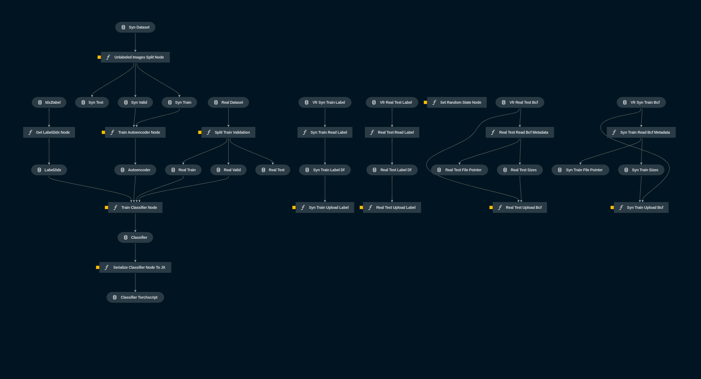

# **FontR**

# **Info about project**

FontR is a font recognition project aimed at creating a solution for font recognition based on the idea proposed by one of the team members. The project is built on the foundation of Adobe's DeepFont research, which can be found in their paper here. https://arxiv.org/pdf/1507.03196v1.pdf

Team members:

[@madziejm](https://github.com/madziejm)
[@mleonowicz](https://github.com/mleonowicz)
[@kjpolak](https://github.com/kjpolak)

## **Running**

To run the project, follow the steps below:

Install the required dependencies:
```
poetry run pip install -r src/requirements.txt
```

Build the project requirements:
```
poetry run kedro build-reqs
```

Run the project:
```
poetry run kedro run
```

You can also run specific pipeline using `-p` flag if you want to skip reproducing steps.
For example to run the model training and evaluation part run:
```
poetry run kedro -p data_science
```

To build our solution we used [`kedro`](https://kedro.org/) framework.
Kedro is a Python framework for building scalable, maintainable, and reproducible data pipelines
It provides a standardized project structure and features for data engineering, machine learning, and production deployment, simplifying the development of end-to-end data solutions.

To manage dependencies our solution uses [`poetry`](https://python-poetry.org/) which is a Python dependency manager, thanks to which a lock of dependencies can be generated, which increases reproducibility and replicability.

To store our data we use `s3` which is Amazon storage solution.
To use your own storage you need to change `filepath` parameters in `conf/base/catalog.yml` and values in `conf/base/parameters/bcf_preprocessing.yml`.

## **Weights and Biases logging**

Weights and Biases (W&B) is a platform for tracking, visualizing, and optimizing machine learning experiments, which we use in our project.
It is required to run the project.

To use W&B logging in this project create a file named credentials_wandb.yml in the `conf/local` directory. It should have one attribute called `api_key` that stores an API Key to your W&B account.

Once you have set up the `credentials_wandb.yml` file, you can run the project and enjoy the benefits of W&B logging. The project will automatically log relevant experiment metrics and provide visualizations through the W&B platform.

## **AdobeVFR Dataset**

AdobeVFR dataset focuses on popular fonts and consists of synthetic and real-world data. The dataset is divided into four parts.

1. **Synthetic Data**
   - **VFR_syn_train:** This subset contains 1,000 images per class for training.
   - **VFR_syn_val:** This subset includes 100 images per class for validation.
   
   To generate synthetic training data, the dataset creators render long English words sampled from a large corpus. The resulting text images are tightly cropped, grayscale, and size-normalized. Each of the 2,383 font classes in the dataset has 1,000 training images and 100 validation images.

2. **Real-world Data**
   - **VFR_real_test:** This subset consists of 4,384 real-world test images with reliable font labels. These images were collected from typography forums where users seek help in identifying fonts. The images are converted to grayscale, manually cropped, and normalized to a height of 105 pixels. These images exhibit larger appearance variations due to scaling, background clutter, lighting, noise, perspective distortions, and compression artifacts.
   - **VFR_real_u:** This subset contains 197,396 unlabeled real-world images. These images were not annotated with font labels but were utilized to pre-train a "shared-feature" extraction subnetwork to reduce the domain gap.

Also a fontlist specifying the 2,383 font classes used in the dataset is provided, allowing to download the corresponding font files (.otf) and render synthetic images.

Furthermore, the text mentions the availability of sample codes, provided in bcf format, for processing the dataset. These sample codes are intended for use with cuda-convenet and are not optimized for product-level usage.

Examples:


## Architecture

Our solution consists of three distinct `kedro` pipelines:

### `bcf_preprocessing`
This pipeline focuses on the preprocessing steps necessary for the solution. It handles tasks such as downloading, preparing, and uploading images to the Amazon S3 storage. These images are essential for replicating the original DeepFont implementation.

### `data_processing`
The data_processing pipeline is responsible for splitting the prepared dataset and feeding it into the models used in the solution.

### `data_science`
The data_science pipeline represents the core component of our solution. It encompasses the training, evaluation, and serialization processes for both the encoder and classifier models. This pipeline is where the machine learning magic happens, as it leverages the provided data to train accurate models capable of font recognition.

By leveraging the capabilities of the kedro framework, we were able to develop a robust and efficient solution for font recognition, with clearly defined and modular pipelines that enable easy maintenance, reproducibility, and scalability

Visualisation of the project using `kedro-viz` can be seen bellow:


## Results

TODO:

## Sources

Publications on the problem of font recognition:

- Convolution Neural Networks for Arabic Font Recognition
Abstract: https://ieeexplore.ieee.org/document/9067875
Paper: https://sci-hub.se/10.1109/SITIS.2019.00031

- Large-Scale Visual Font Recognition (bardzo archaiczne, 2014)
Paper: https://openaccess.thecvf.com/content_cvpr_2014/papers/Chen_Large-Scale_Visual_Font_2014_CVPR_paper.pdf

- Font Recognition in Natural Images via Transfer Learning
Abstract: https://www.researchgate.net/publication/322424375_Font_Recognition_in_Natural_Images_via_Transfer_Learning
Paper: https://sci-hub.se/10.1007/978-3-319-73603-7_19

- Farsi Font Recognition Using Holes of Letters and Horizontal Projection Profile (2011, bardziej jako ciekawostka)
Abstract: https://link.springer.com/chapter/10.1007/978-3-642-27337-7_21
Paper: https://sci-hub.se/10.1007/978-3-642-27337-7_21

- HENet: Forcing a Network to Think More for Font Recognition
Abstract: https://dl.acm.org/doi/10.1145/3503047.3503055
Paper: https://arxiv.org/pdf/2110.10872.pdf

- Convolutional Neural Networks for Font Classification
Paper: https://arxiv.org/pdf/1708.03669.pdf

## **Code layout and pipeline** - highlights

```
src/
┣ fontr/
┃ ┣ fontr/
┃ ┃ ┣ autoencoder.py
┃ ┃ ┣ classifier.py
┃ ┃ ┣ logger.py
┃ ┃ ┣ transforms.py
┃ ┃ ┗ __init__.py
┃ ┣ pipelines/
┃ ┃ ┣ bcf_preprocessing/
┃ ┃ ┣ data_processing/
┃ ┃ ┣ data_science/
┃ ┃ ┣ nodes.py
┃ ┃ ┗ __init__.py
┃ ┣ datasets.py
┃ ┣ pipeline_registry.py
┃ ┣ settings.py
┃ ┣ __init__.py
┃ ┗ __main__.py
┣ tests/
┃ ┣ pipelines/
┃ ┃ ┗ __init__.py
┃ ┣ conftest.py
┃ ┣ test_autoencoder.py
┃ ┣ test_classifier.py
┃ ┣ test_run.py
┃ ┗ __init__.py
┣ requirements-test-only.txt
┗ requirements.txt
```
